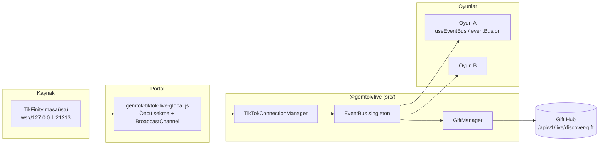

# GemTok EventBus mimarisi

Bu doküman, TikTok canlı olaylarının oyunlara **tek bir iletişim katmanı** üzerinden nasıl aktığını açıklar. Hedef: oyunların **TikFinity WebSocket** veya ham JSON ile doğrudan konuşmaması.

## Oyun migrasyonu (vanilla)

Yerel HTML/Vite oyunları, doğrudan TikFinity WebSocket açmak yerine şu sırayı kullanır:

1. `gemtok-tikfinity-client.js`
2. `sira/gemtok-tiktok-live-global.js`
3. `gemtok-live-game-bridge.js`
4. `GemTokLiveGameBridge.ensure({ hubBase })` ve `onPayload(...)` veya `GemTokTikTokLive.eventBus.on(...)`

Ayrıntılı oyun listesi: **`docs/EventBusMigrationReport.md`**.

## Akış diyagramı



- **Portal sayfaları** (`sira/index.html` vb.): `GemTokTikTokLive.bootstrap` zaten tek WebSocket + çok sekme köprüsünü kurar.
- **TypeScript paketi** (`src/`): `TikTokConnectionManager.start({ portalBridge: "auto" })` varsayılan olarak `GemTokTikTokLive` varsa ondan olayları **rAF kuyruğu** ile `EventBus`’a aktarır; **ikinci WebSocket açılmaz**.
- **Portal dışı** gömülü oyun (yalnızca `gemtok-tikfinity-client.js` yüklü): `portalBridge: false` ile doğrudan `GemTokTikFinity.createClient` kullanılır; yine oyunlar yalnızca EventBus dinler.

## Olay türleri

| Olay | Açıklama |
|------|-----------|
| `gift`, `like`, `follow`, `share`, `member`, `subscribe` | TikTok canlı yükü (TikFinity ayrıştırmasıyla uyumlu). |
| `chat` | Yukarıdakilere uymayan tüm diğer payload’lar (ör. `join_pick`, `lane_pick`). |
| `connection` | WebSocket bağlı (öncü sekme veya doğrudan mod). |
| `disconnect` | Bağlantı kapandı / devre dışı / hata. |
| `reconnect` | Yeniden bağlanma denemesi. |
| `giftmanager:discovered` | Gift Hub’a canlı keşit yapıldıktan sonra (yalnızca doğrudan mod + `enableGiftManagerDiscover`). |

Tipler: `src/types/tiktok.ts`.

## Abone olma

```ts
import { getEventBus, getTikTokConnectionManager } from "@gemtok/live";

getTikTokConnectionManager().start({
  hubBase: "http://127.0.0.1:8787",
  portalBridge: "auto",
});

getEventBus().on("gift", (gift) => {
  /* oyun mantığı */
});
```

## Abonelikten çıkma

```ts
const bus = getEventBus();
const handler = (gift: GiftEvent) => { /* ... */ };
bus.on("gift", handler);
// ...
bus.off("gift", handler);
```

`clear("gift")` ilgili olaydaki tüm dinleyicileri kaldırır; `clearAll()` tümünü siler.

## React: `useEventBus`

```tsx
import { useEventBus } from "@gemtok/live";

useEventBus("gift", (gift) => {
  console.log(gift);
});
```

Mount’ta `on`, unmount’ta `off` — bileşen başına otomatik.

## Performans

- `TikTokConnectionManager` gelen olayları bir **kuyruğa** alır, **`requestAnimationFrame`** ile kademeli olarak `EventBus.emit` çağırır (`maxEventsPerFrame`, varsayılan 64).
- Amaç: saniyede çok sayıda like/hediye geldiğinde bile ana iş parçacığını kilitlememek ve React tarafında gereksiz render fırtınasını azaltmaya yardımcı olmak (oyun tarafında yine `useMemo` / throttle önerilir).

## Yeni oyun kuralları

1. **TikFinity’ye veya WebSocket’e doğrudan bağlanma** — yalnızca `TikTokConnectionManager` (veya portal `GemTokTikTokLive`).
2. **Ham TikTok JSON’unu ayrıştırma** — `gemtok-tikfinity-client` + köprü zaten `GiftEvent` vb. yapıya çevirir.
3. Dinleme: `getEventBus().on(...)` veya `useEventBus(...)`.

Örnek bileşen: `src/examples/GameEventIntegration.tsx`.

## Derleme ve içe aktarma

Kök dizinde:

```bash
npm install
npm run build
```

Çıktı: `dist/gemtok-live.js` (+ bildirim dosyaları). Vite/React tabanlı oyunlar `package.json` içinde bu pakete path ile bağlayabilir veya derlenmiş ESM dosyasını statik sunar.

## İlgili yerel dosyalar

- `gemtok-tikfinity-client.js` — TikFinity WebSocket istemcisi.
- `sira/gemtok-tiktok-live-global.js` — Öncü sekme, BroadcastChannel, vanilla `eventBus` (TS köprüsüyle aynı olaylar hizalanır).
- `gift-hub` — REST + SQLite hediye kataloğu ve canlı keşif uçları.
